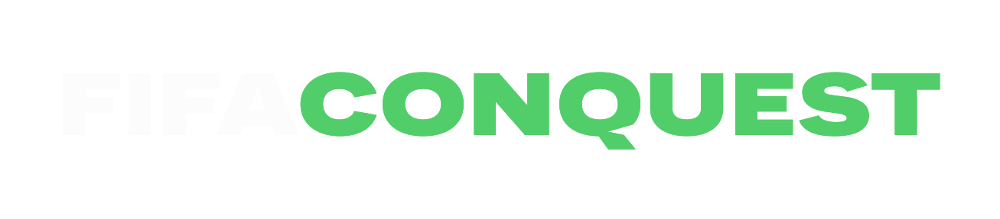

<p align="center">
  
</p>

FIFACONQUEST is a companion for a game mode that me and my friends have been playing for some time.

If i remember correctly, one of my friends saw a FIFA youtube video where a guy was conquering a map. That video was also based on another guy doing something like this in an NFL or NBA game, i dont remember exactly. Then we started playing it, and as time went on we kept changing rules, adding stuff, removing stuff, and making it more of our own thing.

This is basically the board that keeps everything together. It was coded by AI with my assistance. I will not lie and say i coded everything myself like everyone that "vibecode" something and suddenly acts like a software company. This is not for work, i dont intend on making money from it, and it is not some insane revolutionary thing either. Anyone could probably make something similar in a few hours if they really wanted to.

It is just a fun thing for a very specific stupid game we like playing.

## The Idea

The idea is simple.

You choose the number of players. The game works best with 4 people. 3 is cool as well. We never really played with 5, but the option is there, so try it for yourselves.

Each player gets a random country base. You can play with random teams, or manually choose your 3 teams that will be tied to your base. There is also an elite mode where the top 5 leagues are all in the map, and a random mode where it is basically any team from the database.

The teams database was made using some freaky ass site, so there are probably things wrong there. Not every team is in the database. Some leagues may be outdated(i think the polish league has some teams that should be on fc26 but when we looked it up they were not there,so if that happens im sorry, but in our game we just picked another team from the same league that had similar overall rating and it was fine). Some league names may be weird. You can edit it pretty easily in the codebase. If you use mods, lets say a Brazilian league mod or something like that, you can add the teams in `data/teams.js` and it should work if you follow the same format.

## How The World Conquest Works

You attack territories on the map.

You can attack:

- a territory adjacent to yours;
- a territory connected by a naval route;
- whatever else you decide if you want to make house rules.

When you attack, the game is played in FIFA / EA FC outside the app. The app does not play for you, it just tracks the results.

You can make any FIFA rule you want:

- first to score;
- normal match;
- golden goal;
- 3 goal difference ends the game;
- whatever your friend group enjoys.

If the attacker wins, they take the territory.

If the attacker loses, they lose the territory they attacked from.

If the attacker used their initial base and loses, they lose the team they attacked with and one life. If you lose all 3 base teams, you are out of the game.

But you can come back. In our rules, eliminated players can return if they win 3 territory defenses as a neutral/NPC defender.

## Winning Streaks And Turn Order

If you keep winning, you can keep going.

After winning 3 attacks in a row, you can swap the place of one of your teams on the board with another one of your teams.

The player defending should always rotate. Example in a 4 player game:

```txt
P1 attacks P2
P1 attacks P3
P1 attacks P4
then it loops
```

If P1 loses to P3, then when P3 starts attacking, P3 would play against P4, then P1, then P2.

This is just how we do it. Most of the rules in here are just things we found out worked after playing. You can play however you want.

There is also a pass turn button. So if your group does not like one guy winning forever, you can make a rule that forces turns to pass.

One PUSSY ass rule is: in the first 3 turns, each player can only attack once, then must pass the turn even if they win. I personally think this is weak, but do whatever makes your friends not cry.

## Challenge Cards

There are challenge cards in the menu.

This was a friend's idea. It is kinda cool, but it can also be unfair depending on the cards and your group.

You can edit the challenge card files in the `desafios/` folder and make the challenges fit your own group.

The files are split by language:

- `desafios/pt.js`
- `desafios/en.js`
- `desafios/es.js`
- `desafios/fr.js`
- `desafios/it.js`

Like a board game, things are still tracked by the players. So remember: this is a gentleman game. Dont cheat your buddies. They are your buddies.

It is fun to win, and it is also fun to want to hurt yourself when you lose in the dumbest possible way. Dont cheat, dont throw games, have fun.

## FIFA Chess

FIFA Chess is the same spirit but with chess.

I think it is cooler than playing normal conquest with only 2 people. We usually play this with a real chess board, but the virtual board helps keeping track of the teams and captures.

Every chess piece has a football team. When a piece attacks another piece, you play FIFA to decide if the capture actually happens.

Suggested rule:

- Play only until the first goal.
- If the attacker scores first, the capture succeeds.
- If the defender scores first, the defender holds.
- If a piece attacks the King and loses, the attacking piece is removed.
- If checkmate would happen in normal chess, the attacking player still needs to win the FIFA capture against the King to finish the game.

You can use random teams, the locked elite pool, or manually choose the team for every chess piece.

## Running The App

The easiest way is just opening the HTML file.

1. Download or clone the repo.
2. Open `fifa-world-domination.html` in a modern browser.
3. Play.

It is just HTML, CSS and JavaScript.

Its very lazy and dumb, but it works.

If you want the Electron version:

```bash
npm install
npm start
```

If you want to build the Windows portable app:

```bash
npm run build
```

If there is a release build on GitHub, just download the `.exe`. That is easier if you dont want to mess with Node, npm, terminal stuff, all that.

## Editing Stuff

Most things are data files.

Teams are in:

```txt
data/teams.js
```

Countries and map rules are mostly in:

```txt
data/map-data.js
data/world-geojson.js
```

Languages are in:

```txt
lang/
```

Challenge cards are in:

```txt
desafios/
```

If you change country IDs, saves can break. If you change team names, keep the names consistent in the database. Nothing fancy, just dont create two different spellings for the same team and then wonder why it broke. you can change anything, this are the easiest things to change but to change hardcoded rules and stuff you can just plug into an AI and ask for it it will probably nail first time, theres nothing that complicated in here anyway.

## Saves

The app has auto save and also lets you download save files.

Manual saves are JSON files. Save before starting a new match if you care about the current one.

## Project Structure

```txt
fifa-world-domination.html  Main app shell
js/                        Game modules and core setup logic
styles/                    CSS entrypoint and partials
assets/                    Logos, icons and fonts
data/                      Team database, territory data and map geometry
lang/                      UI translations
desafios/                  Challenge cards by language
electron/                  Desktop wrapper
```

## I want to make a site with this code and put ads on it can I?
i dont care, do whatever you want with it. but keep in mind that if you get into any legal trouble i also dont care, and i will not help you with anything, I do hope for you succes but also i wouldnt not want to see you fail lol, but if you make any type of money off of this please, send me a pics or video of you sitting on the pile of cash and i will send you a video of me eating molded bread and drinking dirty water.


## Final Notes

This is a fan-made party tool for people who want to make FIFA / EA FC sessions more dramatic and longer than they should be.

It is not affiliated with EA, FIFA, any league, club, confederation or anyone else.

Have fun, change the rules, argue, make a save, cry, patch the rules, and run it back.
